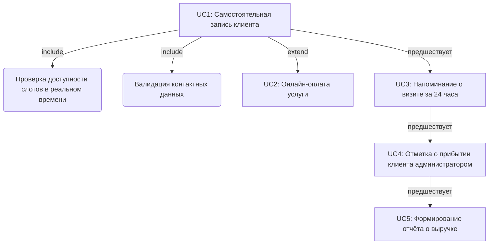

# АНАЛИТИЧЕСКИЙ ОТЧЁТ

**Проект:** Автоматизация салона красоты «Блеск»  
**Аналитик:** Абрамова Оксана Витальевна  
**Дата:** 26.07.2026г.

---

## Раздел 1. Описание предметной области

**Предметная область:** Салон красоты «Блеск» (5 мастеров, администратор, директор). Услуги: стрижка, окрашивание, укладка, маникюр.

**Текущая ситуация:**

- Запись клиентов ведётся в бумажном журнале
- Взаимодействие с клиентами — по телефону
- Учёт оплаты — ручной
- Отчётность — ручной пересчёт журнала директором

**Цель автоматизации:** Создать систему онлайн-записи и учёта для салона красоты.

**Ожидаемый результат:**

- Клиенты записываются онлайн самостоятельно
- Администратор управляет расписанием в системе
- Система отправляет автоматические напоминания
- Система ведёт учёт оплаты и формирует отчёты

---

## Раздел 2. Модель AS IS («как есть сейчас»)

**Процесс:** Запись клиента на услугу и оказание услуги

**Участники:**

1. Клиент
2. Администратор
3. Мастер
4. Директор

**Шаги процесса:**

1. Клиент звонит/пишет администратору с запросом на запись
2. Администратор открывает бумажный журнал, ищет свободное время
3. Если есть слот — записывает; если нет — предлагает другое время (клиент соглашается или отказывается)
4. Администратор вручную записывает в журнал: имя, телефон, услугу, мастера, время
5. За сутки до визита администратор обзванивает клиентов для напоминания
6. Клиент приходит в салон, администратор отмечает в журнале «Пришёл»
7. Мастер выполняет услугу
8. Администратор считает сумму к оплате, клиент платит (наличные/перевод)
9. Администратор записывает оплату в журнал
10. Директор вручную пересчитывает журнал для отчёта о выручке

**Проблемы текущего процесса:**

1. **Риск потери данных** — журнал один, при болезни администратора никто не знает расписание
2. **~1 час/день на обзвон** — администратор тратит время на рутинный обзвон, всё равно ~15% неявок
3. **30 минут на подсчёт выручки** — директор ежедневно вручную пересчитывает журнал
4. **Нет самозаписи** — клиент может записаться только через звонок в рабочее время

---

### Раздел 2.1. Протокол анализа методом 3-х цветов (дополнительно)

🟢 **Факты:** В салоне 5 мастеров, 1 администратор, 1 директор. Учёт ведётся в бумажном журнале. Обзвон занимает ~1 час в день. Директор считает выручку вручную.

**Допущения:**

- [Допущение] У салона есть базовая ИТ-инфраструктура (Wi-Fi, компьютер/планшет у администратора)
- [Допущение] Клиенты готовы использовать мобильное приложение или веб-форму для записи

  **Противоречия и Риски:** Администратор заинтересован в минимизации усилий (ручной обзвон утомителен), но директор заинтересован в максимальном контроле и заполненности расписания. Единый бумажный журнал создаёт критическую точку отказа (SPOF).

---

### Раздел 2.2. Ролевая модель и карта целей (дополнительно)

| Роль              | Цель в системе                                                                 | Конфликт интересов                                                                  |
| ----------------- | ------------------------------------------------------------------------------ | ----------------------------------------------------------------------------------- |
| **Клиент**        | Быстро и удобно записаться на удобное время без ожидания на линии              | Хочет максимальной гибкости отмены/переноса, что может привести к простоям мастеров |
| **Администратор** | Минимизировать рутинные операции (обзвон, запись) для фокуса на сервисе в зале | Может сопротивляться внедрению системы, если она усложнит привычный рабочий процесс |
| **Директор**      | Получить прозрачный контроль над расписанием и выручкой в реальном времени     | Требует строгого учёта, что может восприниматься персоналом как тотальный контроль  |

---

## Раздел 3. Точки автоматизации

| №   | Шаг AS IS                                   | Проблема                                   | Решение                             | Эффект                          | Приоритет |
| --- | ------------------------------------------- | ------------------------------------------ | ----------------------------------- | ------------------------------- | --------- |
| 1   | Поиск времени в бумажном журнале (шаги 2-3) | Долго, неудобно, риск ошибки               | Календарь со слотами в системе      | Ускорение записи в 3 раза       | MUST      |
| 2   | Обзвон клиентов за сутки (шаг 5)            | 1 час/день, клиенты забывают (~15% неявок) | Push/SMS-напоминание за 24 часа     | Неявки: 15% → 5%                | MUST      |
| 3   | Запись данных со слов (шаг 4)               | Ошибки в написании телефона, имени         | Валидация данных при вводе          | Снижение ошибок в базе          | COULD     |
| 4   | Ручной учёт оплаты (шаги 8-9)               | Ошибки, непрозрачность, риск хищений       | Онлайн-оплата + автоматический учёт | Прозрачность и контроль         | COULD     |
| 5   | Подсчёт выручки вручную (шаг 10)            | 30 минут/день, ошибки, ручной труд         | Автоматический отчёт по выручке     | Экономия 30 мин./день директора | MUST      |
| 6   | Запись только через звонок (шаг 1)          | Неудобно клиентам, пропускаем запросы      | Самозапись через приложение         | Привлечение новых клиентов      | SHOULD    |

---

### Раздел 3.1. Точки взаимодействия (Touchpoints) (дополнительно)

**Цифровые:** Веб-форма записи / Мобильное приложение, Push-уведомления, SMS-шлюз, интерфейс администратора (веб-панель)

**Физические:** Визит клиента в салон, выполнение услуги мастером

**Интеграционные:** Платёжный шлюз (для онлайн-оплаты или фиксации факта наличной оплаты), сервис отправки уведомлений

---

## Раздел 4. Модель TO BE («как должно быть»)

**Процесс:** Запись клиента на услугу и оказание услуги (TO BE)

**Участники:**

1. Клиент
2. Система
3. Администратор
4. Мастер

**Шаги процесса:**

1. Клиент открывает приложение/веб-форму, выбирает услугу и мастера
2. **Система** показывает календарь со свободными слотами в реальном времени
3. Клиент выбирает дату и время, вводит имя и телефон
4. **Система** проверяет доступность слота и создаёт запись
5. **Система** отправляет клиенту подтверждение записи (push/SMS)
6. **Система** за 24 часа автоматически отправляет напоминание о записи
7. Клиент приходит в салон, администратор отмечает в системе «Клиент пришёл»
8. Мастер выполняет услугу, администратор отмечает в системе «Услуга оказана»
9. **Система** автоматически считает сумму к оплате
10. Клиент оплачивает (онлайн в приложении или наличными), администратор фиксирует в системе
11. **Система** сохраняет оплату и автоматически обновляет статистику выручки

**Что изменилось по сравнению с AS IS:**

1. 📒 Бумажный журнал → Облачный календарь с доступом в любое время
2. Ручной обзвон → Автоматические Push/SMS-напоминания
3. ✍ Запись со слов → Самозапись с валидацией данных
4. 🧮 Ручной учёт → Автоматический учёт оплаты
5. 📊 Ручной отчёт → Автоматический отчёт по выручке

---

### Раздел 4.1. Сценарий использования Use Case (дополнительно)

**Имя:** Самостоятельная запись клиента на услугу через приложение

**Цель:** Клиент успешно записывается на услугу к выбранному мастеру без участия администратора

**Предусловия:**

1. Клиент открыл мобильное приложение салона
2. В системе настроено актуальное расписание мастеров и прайс-лист услуг
3. У клиента есть активное подключение к сети Интернет

**Триггер:** Клиент нажимает кнопку «Записаться» в главном меню приложения

**Основной поток:**

1. Клиент выбирает категорию услуги из списка
2. Система отображает доступных мастеров для выбранной услуги
3. Клиент выбирает конкретного мастера
4. Система отображает календарь со свободными временными слотами выбранного мастера
5. Клиент выбирает удобную дату и время
6. Система резервирует выбранный слот на 10 минут
7. Клиент вводит свой номер телефона
8. Система валидирует формат номера телефона
9. Клиент нажимает кнопку «Подтвердить запись»
10. Система создаёт запись в базе данных
11. Система снимает резерв со слота, переводя его в статус «Занят»
12. Система отправляет клиенту Push-уведомление с деталями записи

**Альтернативный поток:**

- _Шаг 4._ Система не находит свободных слотов у выбранного мастера
- _Шаг 4а._ Система предлагает записаться к другому мастеру или на другую дату
- _Шаг 4б._ Клиент выбирает альтернативного мастера
- _Шаг 4в._ Возврат на шаг 4

**Исключительная ситуация:**

- _Шаг 8._ Система обнаруживает некорректный формат номера телефона
- _Шаг 8а._ Система выводит сообщение об ошибке и блокирует кнопку подтверждения
- _Шаг 8б._ Клиент вводит корректный номер
- _Шаг 8в._ Возврат на шаг 9
- _ИЛИ_ Клиент закрывает приложение на шаге 8а. **Результат:** цель не достигнута, запись не создана, резерв слота аннулируется через 10 минут

**Постусловия:**

1. В системе создана новая активная запись со статусом «Ожидает визита»
2. Выбранный временной слот мастера помечен как «Занят» и недоступен для других клиентов

---

### Раздел 4.2. Взаимосвязи сценариев (Mermaid) (дополнительно)

---

## Раздел 5. Приоритизированный список требований

### MUST HAVE (ядро системы):

1. **Календарь со свободными слотами** — отображение расписания мастеров в реальном времени
2. **Push/SMS-напоминания за 24 часа** — автоматическая отправка уведомлений клиентам
3. **Автоматический отчёт по выручке** — формирование отчёта за день/неделю/месяц
4. **Управление расписанием администратором** — возможность просмотра и редактирования записей

### SHOULD HAVE (основной функционал):

1. **Самостоятельная запись клиента через приложение** — веб-форма или мобильное приложение для клиентов
2. **Профили мастеров с услугами и ценами** — каталог услуг с указанием стоимости

### COULD HAVE (дополнительно):

1. **Онлайн-оплата в приложении** — интеграция с платёжным шлюзом
2. **Валидация телефона при вводе** — проверка формата номера телефона
3. **История посещений клиента** — отображение предыдущих визитов

### WON'T HAVE (не в этой версии):

1. Интеграция с Instagram для записи
2. Программа лояльности и бонусы

---

### Раздел 5.1. Нефункциональные требования NFR (дополнительно)

**⚠️ Примечание:** Данные параметры являются **предложениями** и требуют согласования с заказчиком.

**Доступность:**

- Система календаря должна быть доступна для клиентов 24/7
- _Предлагаемый target:_ uptime 99.9% (требует обсуждения)

**Производительность:**

- Время отклика системы при проверке свободных слотов
- _Предлагаемый target:_ не более 500 мс (p95) (требует обсуждения)

**Надёжность данных:**

- Резервное копирование базы данных записей
- _Предлагаемое решение:_ автоматическое резервное копирование каждые 24 часа (требует обсуждения)

**Безопасность:**

- Защита персональных данных клиентов
- _Предлагаемое решение:_ соответствие 152-ФЗ, шифрование данных (требует обсуждения)

---

## Раздел 6. Открытые вопросы к заказчику

1. Планируется ли интеграция с существующими системами телефонии (IP-телефония) для автоматического определения номера звонящего клиента?

2. Должна ли система поддерживать частичную или полную предоплату услуг через онлайн-эквайринг на этапе записи, или оплата фиксируется только по факту визита?

3. Каковы бизнес-правила отмены записи клиентом? (Например, бесплатная отмена за 12 часов, иначе штраф или блокировка возможности онлайн-записи)

4. Требуется ли разграничение прав доступа в системе между администратором (полный доступ к расписанию) и мастером (только просмотр своего расписания)?

5. Какие метрики успеха проекта? (Снижение неявок на X%, экономия времени администратора Y часов/неделю)

---

**Статус документа:** Готов к сдаче  
**Следующие шаги:** Согласование TO BE с заказчиком, детализация требований MUST HAVE

---

### 💡 Комментарий аналитика:

Данный отчёт структурирован в соответствии с обязательными требованиями задания:

- ✅ Раздел 1: Описание предметной области
- ✅ Раздел 2: Модель AS IS (10 шагов, 4 участника, 4 проблемы)
- ✅ Раздел 3: Точки автоматизации (6 точек с приоритетами)
- ✅ Раздел 4: Модель TO BE (11 шагов с явным указанием действий системы)
- ✅ Раздел 5: Приоритизация MoSCoW (MUST/SHOULD/COULD/WON'T)
- ✅ Раздел 6: Открытые вопросы

**Дополнительные материалы** (Use Case, Mermaid, NFR, ролевая модель) размещены как подразделы 2.1, 2.2, 3.1, 4.1, 4.2, 5.1 **после** обязательных разделов, чтобы не нарушать структуру задания.

**Технические параметры** (SLA, время отклика, резервное копирование) перенесены в Раздел 5.1 с явной пометкой «требует согласования», чтобы отделить подтверждённые сведения кейса от предложений аналитика.
